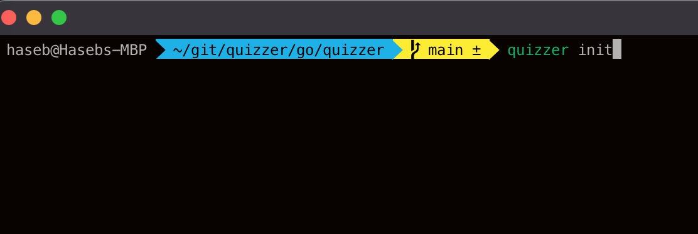
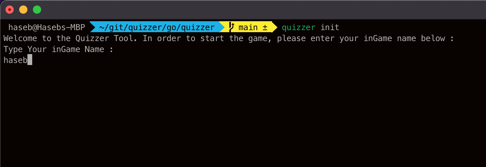
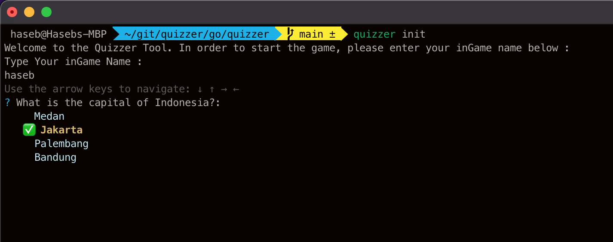
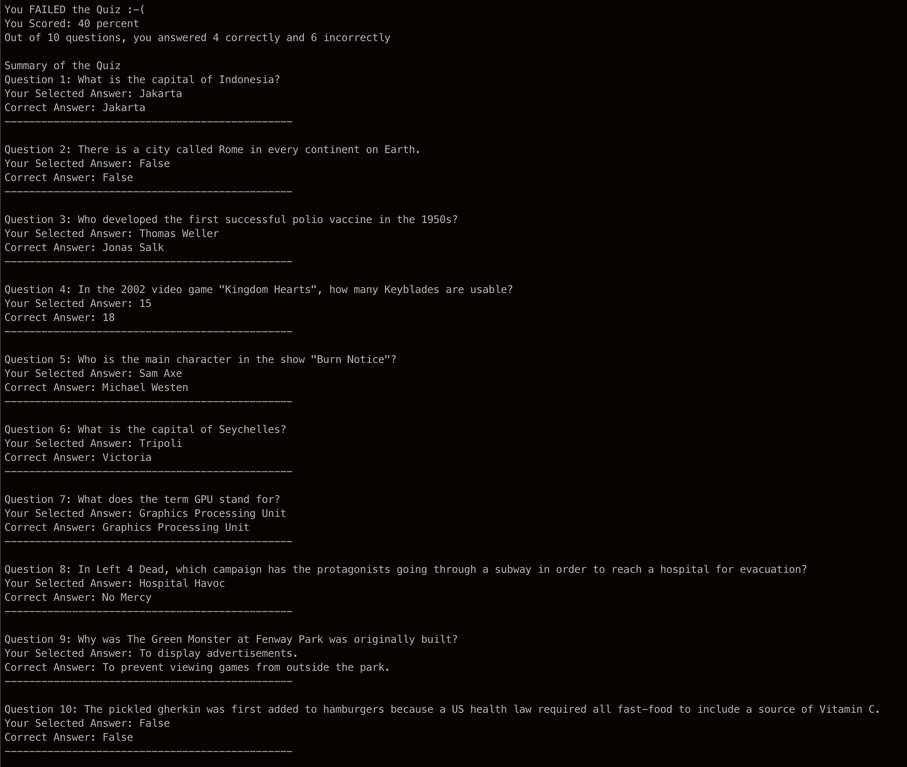
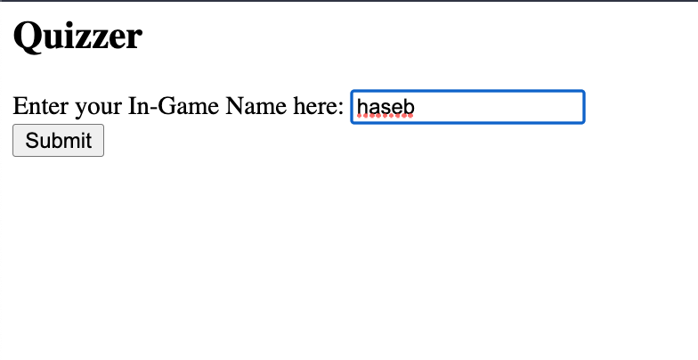
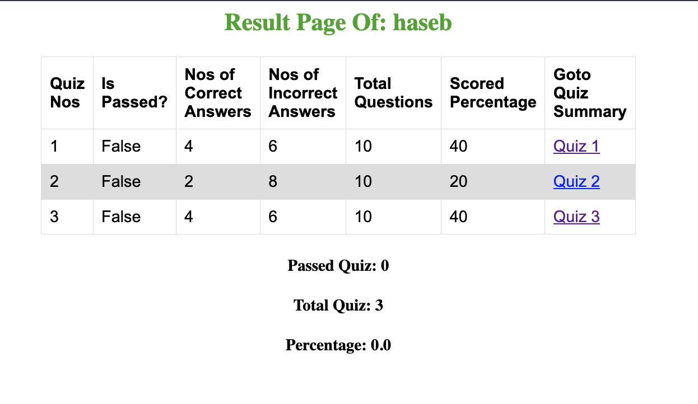
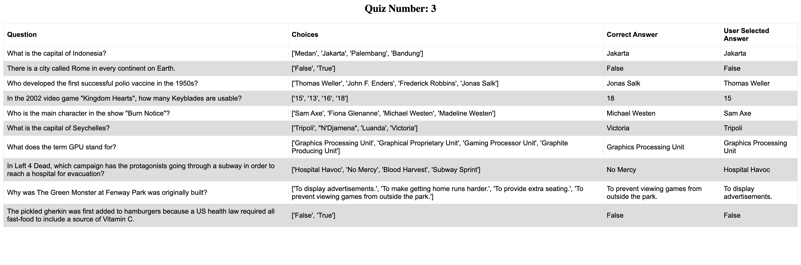
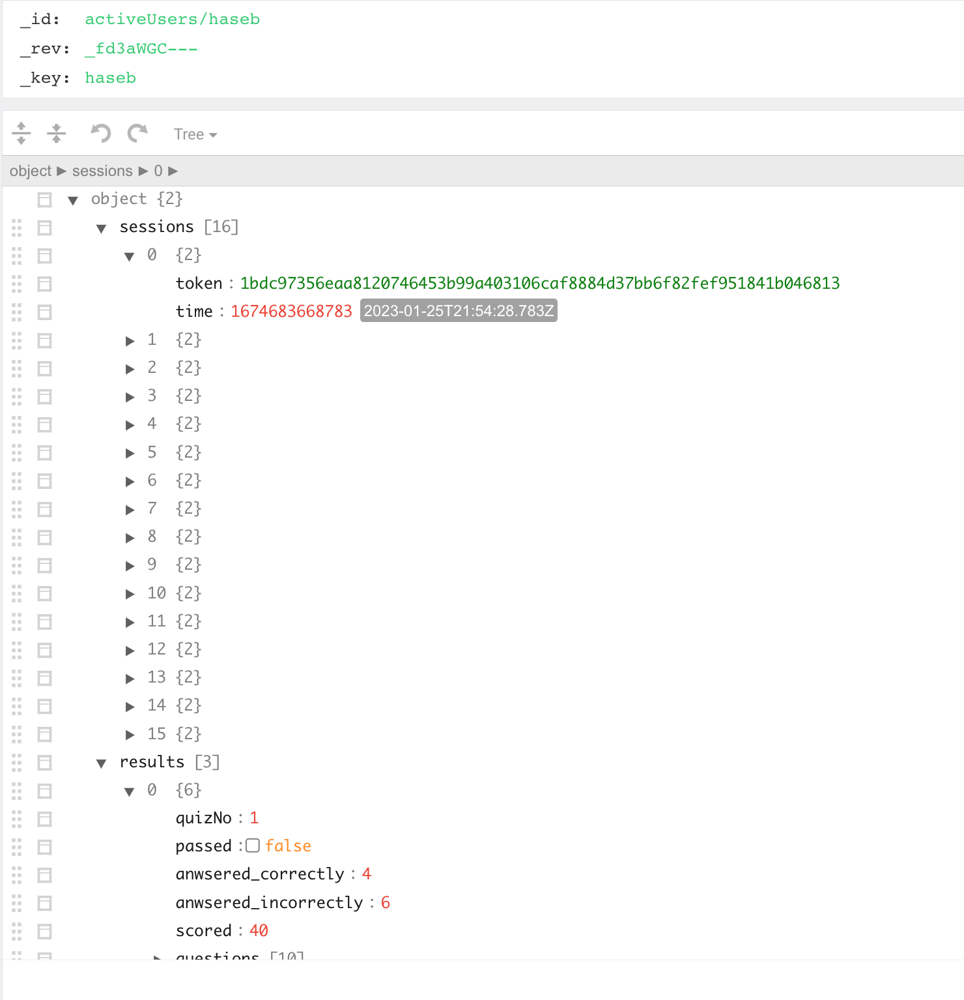

# Quizzer

The ``quizzer`` is a command line tool or interface which is built in GoLang and is using the `cobra` library. The command line tool integrates with the [OpenTDB](https://opentdb.com/) APIs to prepare a random questions Quiz platform. At the end of the quiz, the results are shown whether ``PASSED`` or ``FAILED`` with the quiz summary and selected answers in the terminal itself. Total number of questions for any round of quiz game is always 10 questions per round.

Then to visulaize the result, `Flask` library is used with `python`. 

### Prerequisites:
1.  GoLang must be installed (version used 1.19.5)
2.  Python must be installed (version used 3.9)

### Run the CLI Tool
To start using the CLI tool,
1.  Clone the project and goto the `go` directory
2.  Execute the command, `go install` from the directory. This  creates a binary package of this project called `quizzer` in this case.
3.  The above package will be place at the `GOPATH`. To check your `GOPATH` kindly execute the command `go env`. If the env is not set then, do the following:
    > `mkdir ~/go`  
    > `Then set $GOPATH in .bashrc`  
    > `export GOPATH=~/go`  
    > `export PATH=$PATH:$GOPATH/bin`

4.  Then execute, `quizzer init`. This is the only command provisioned by the tool. Once this command is executed, it will follow through the whole process till the end.
5.  The user identification is mainly done by the `inGame Name` or `username`.

#### Tokenization
> **NOTE:** The tokens for a user session are regenerated if or when one of the below case occurs;
> 1.  For an existing user, the new quiz is started after `6 hours` from the last quiz taken
> 2.  The questions are ``exhausted`` from OpenTDB database, then the tokens are reset, meaning be prepared for repeating questions

 

### GO Steps with Images:

 

Initialize the tool

 

Enter in-Game Name

 

Select answers:

 

Quiz Summary:

 

### Visualize the result:
1. Goto to the root directory of the project.
2. Execute the command, `python3.9 python/main.py`. This is will start a simple HttpServer on port `5000`.
3.  Open from the browser and enter, [http://localhost:5000](http://localhost:5000). This will open a simple form, asking the `inGame Name` or `username` for which the quiz result has to be checked.
4.  Once the correct name has been entered, the result page with all the quiz history of the user will be displayed with `total quiz attempted`, `total passed quiz` and `percentage` of the same.
5.  Individual quiz summary(`questions, correct answers, selected answers`) can also be checked by clicking on the link provided in the indiviual row.

**OR**

> From the root directory, execute `sh run.sh` command. This will run the services inside the `docker-compose.yaml` file which inckudes the above `python` app and as well as the `arangodb` NoSQL Database in one go. The `python` app will then be availabe at port `5000` and the `arangodb` will be avaialble at port `8529`. To stop the services, execute `sh stop.sh`

 

### Python Steps with Images:

 

Form to submit the username for the results

 

Results

 

Quiz Summary

 

### ArangoDB NoSQL Database

All the necessary information throughout the lifecycle of the tool are persisted in ArangoDB NoSQL database. To persist the data, ArangoDB's document store is used and the `_key` of the document is made use of to store the ``inGame Name`` or `username` (as the `_key` is always indexed and hence quicker to retrieve the document).

Tokens are saved in the timely manner for the particular user and the sessions are maintained for the user according to the description of the API specifications.

